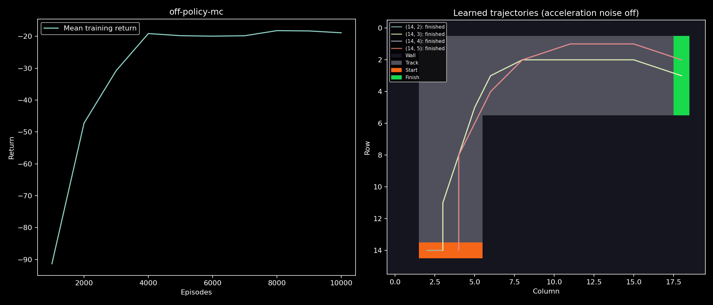
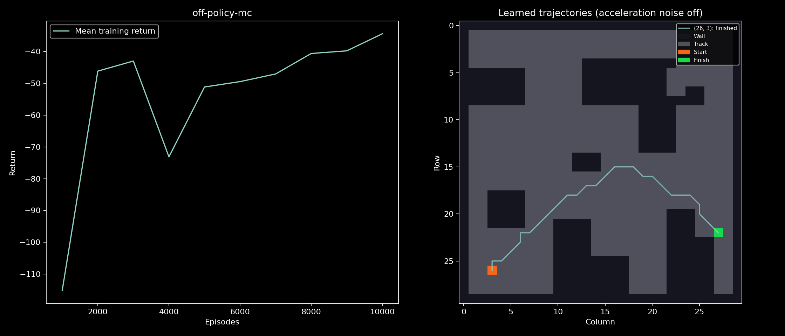
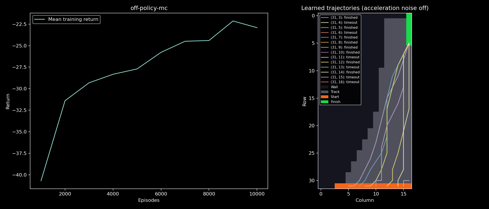
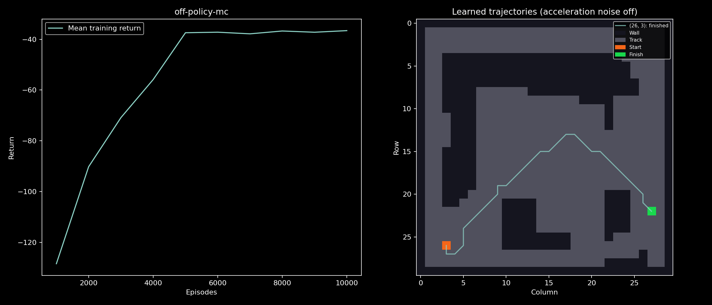
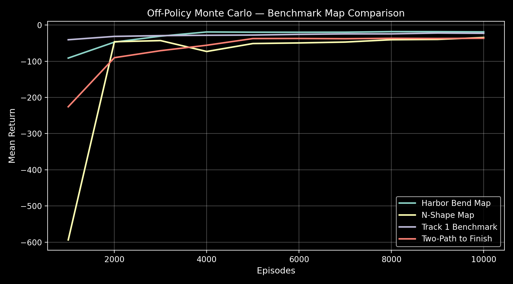

# Ocean RL — Inertial Grid Racetrack Environment

[](https://www.python.org/)
[](https://gymnasium.farama.org/)

Readable, high-performance tabular Reinforcement Learning with continuous ray-marching inertial grid racetrack environments, Farama Gymnasium integration, and off-policy Monte Carlo control algorithms.

---

## 📊 Visual Results & Convergence

### Individual Map Results

| Harbor Bend Map — 100% Success | N-Shape Map — 100% Success |
| :---: | :---: |
|  |  |

| Track 1 Benchmark — 57.1% Success | Two-Path to Finish — 100% Success |
| :---: | :---: |
|  |  |

### Multi-Map Comparison (10,000 episodes)

| |
| :---: |
|  |

---

## 🏁 Benchmark Results

| Map Benchmark | Grid | Movement | Max Vel | fail\_prob | Episodes | Mean Return | Success Rate |
| :--- | :---: | :---: | :---: | :---: | :---: | :---: | :---: |
| **Harbor Bend** | 30 × 30 | Bidirectional | 5 | 0.10 | 10,000 | **-18.90** | **100.0%** |
| **N-Shape Map** | 30 × 30 | Bidirectional | 5 | 0.10 | 10,000 | **-34.43** | **100.0%** |
| **Track 1 Benchmark** | 32 × 17 | Forward-Only | 5 | 0.10 | 10,000 | **-22.92** | **57.1%** |
| **Two-Path to Finish** | 30 × 30 | Bidirectional | 2 | **0.00** | 10,000 | **-36.58** | **100.0%** |

> **Two-Path to Finish** is a maze map with a single start cell and a single finish cell reachable via two winding corridors.
> `fail_prob` must be 0 for Off-Policy MC: with stochastic engine noise the crash-reset rate (~22% per step) creates a
> gravity well around the start cell that prevents the random behaviour policy from ever completing an episode.
> This is the canonical scenario motivating TD algorithms (Q-learning / SARSA) over pure Monte Carlo.
>
> Reproduce with:
> ```powershell
> py -3.12 -m ocean_rl --maps maps/tiled/two_path_to_finish.tmj --movement-mode bidirectional --max-velocity 2 --fail-prob 0 --episodes 10000 --seeds 0 --plot --output-dir results/exp_two_path_10k
> ```

---

## Install

From this directory:

```sh
python -m venv .venv
# PowerShell: .venv\Scripts\Activate.ps1
# Linux/macOS: source .venv/bin/activate
python -m pip install -e ".[images,plots]"
python -m ocean_rl --maps maps/tiled/harbor_bend.tmj --episodes 1000 --plot
```

Core training only: `python -m pip install -e .`. The installed command works
outside the checkout. Explicit map/config paths are relative to your current
directory. Omitted maps use bundled assets. Outputs default to `./results`.
Use distinct output directories for parameter comparisons.

See [CONTRIBUTING.md](CONTRIBUTING.md) for checks, builds and adding systems.

## Run

### Select an objective

`--objective minimum-time` is the unchanged default (-1 per step, 0 at finish).
`--objective geometric-distance` charges negative Euclidean travel distance,
including the final segment up to first contact with the finish cell boundary.
It requires gamma=1 and disables deliberate stationary actions. Noise can still
cause a stationary transition. This retains inertial racetrack dynamics.

```powershell
python -m ocean_rl --system racetrack --maps maps/tiled/n_shape.tmj --objective geometric-distance --gamma 1 --episodes 100000 --max-velocity 2 --output-dir results/n_shape_distance --plot
```

JSON environment settings or a Tiled string property named `objective` can
select the same names; an explicit CLI value overrides the map. Evaluation
reports include distance in grid-cell units and the objective. Distance runs
also receive a distinct output filename prefix. Retrain when changing objectives;
old Q-values estimate a different return.

Crash resets still continue the episode. Travel up to collision is charged;
teleportation is excluded. Thus the distance objective measures accumulated
physical travel across attempts, not a guaranteed collision-free shortest path.
Inspect crashes and completion as well as distance. Truncated MC episodes still
skip updates, so completed-only estimates can be biased. No optimum is guaranteed.

For another reward, implement a stateless strategy with `reward(Transition)` and
`allow_stationary`, then register its no-argument factory with
`ocean_rl.objectives.register_objective` before invoking the CLI. Transition
provides distance, termination and crash status. Set `requires_undiscounted=True`
when discounting would change the intended objective. New physical quantities
(for example energy) require adding measured transition data, not changing MC.

In PowerShell:

```powershell
py -3.12 -m ocean_rl --algorithm off-policy-mc --maps maps/tiled/harbor_bend.tmj --episodes 1000 --plot --show
```

The original command also works:

```powershell
py -3.12 exp_multi_map_racetrack.py --maps maps/tiled/harbor_bend.tmj --episodes 1000 --plot
```

Use a JSON file for algorithm parameters, separately from the map's environment
properties. Parameter priority is registry defaults, then the options file,
then explicitly supplied command-line flags:

```powershell
py -3.12 -m ocean_rl --algorithm off-policy-mc --agent-options configs/off_policy_mc.json --maps maps/tiled/harbor_bend.tmj --epsilon 0.2 --episodes 1000
py -3.12 -m ocean_rl --help
py -3.12 -m unittest discover -s tests -v
```

Run module commands from this Python directory. Existing file-path launchers
work from other working directories; supply map/options paths appropriate to
that working directory. Core training needs NumPy, image import uses Pillow,
Gymnasium provides optional space declarations, and plotting uses Matplotlib.

## Responsibilities

| Component | Owns | Must not depend on |
|---|---|---|
| Map loaders | Converting map files to validated grids | Agent or training |
| Environment | Reset, actions, movement, collisions, rewards, termination | Learning algorithm or plot renderer |
| Algorithm | Exploration, value/policy updates, training schedule, checkpoint format | Map-file format or plotting |
| Evaluator | Running a policy in a separate evaluation environment | Agent's internal Q-table or model weights |
| Experiment | Selecting components, seeds, parameters, reports | Algorithm's internal checkpoint tables |
| Visualization | Rendering recorded curves/maps/routes | Training updates |

The MC code is now in `ocean_rl/algorithms/monte_carlo/off_policy.py`.
`act(state)` selects a deterministic action without changing training state.
The shared racetrack evaluator takes any such policy callable. Checkpoint
serialization belongs to the agent, so another agent need not expose `Q` or
`log_C`. The runner records the selected algorithm and resolved settings.

## Add a new algorithm

1. Put the real implementation in a suitable family under `ocean_rl/algorithms/`.
   For example, a future Q-learning implementation would belong under
   `algorithms/temporal_difference/`; that implementation is not supplied yet.
2. Follow `contracts.Agent`: implement `train`, `act`, and `save_checkpoint`, and
   expose `training_history` and `status`. Constructors accept an environment,
   an optional `seed`, and the algorithm's own parameters.
3. `train(num_episodes, check_interval, verbose=...)` returns episode indices and
   mean-return values for plotting. `status` reports completion and actual work;
   history contains JSON-serializable records. Each algorithm decides how to
   handle termination/truncation consistently with its mathematics.
4. `save_checkpoint(prefix)` writes the actual model state, chooses its file
   extension, and returns the resulting path. The experiment does not inspect it.
5. Register the constructor and its defaults with `register_algorithm` in
   `registry.py`, or register from your own launcher before calling experiment
   `main`. Add tests and an algorithm metadata sidecar.

The registry rejects duplicate names and unknown constructor parameters. The
CLI lists registered names under `--algorithm`; `--agent-options` supplies other
parameters without adding algorithm-specific flags to the runner. The existing
gamma/epsilon/init-q flags are retained for compatibility.

Different algorithm names receive distinct output filename prefixes. Repeating
the same map/seed/algorithm in the same output directory replaces that run's
files; select another `--output-dir` when comparing parameter configurations.

## Add a new environment or system

For another discrete sample-based world, implement the reset/step/action-mask
contract in `contracts.DiscreteEnvironment`. The current MC agent accepts
integer-vector observations and discrete action IDs. It does not require a
racetrack layout, grid dimensions, or Tiled files.

The existing experiment/evaluator is specifically for racetracks: it expects
map geometry, start cells and a configurable clone. A new system such as
Blackjack needs an appropriate experiment/evaluator under those packages.
Continuous-control, image observations and vectorized environments should have
contracts suited to those inputs; they are not automatically supported by the
current tabular MC learner.

In MATLAB the analogous extension points already exist in
`+OceanStats/+RL/+MonteCarlo/IEpisodeEnvironment.m` and its strategy folders.
Python and MATLAB use separate language implementations; no bridge is implied.

## Current MC limitations

The current learner skips updates for truncated episodes and continues trying.
If every episode truncates it reports failure with no learned updates. With
partial truncation, using only completed episodes can bias estimates toward
shorter trajectories; do not infer unbiased convergence from completed runs.
The raw episode records retain timeout counts. This behavior predates the
organization pass and is preserved.

The saved NPZ arrays are inspection checkpoints, not complete resumable RNG
snapshots. The optional legacy `evaluate_learned_policy` method forwards to the
shared racetrack evaluator; new code can call the evaluator directly.

## Verification

The package refactor was checked against seeded pre-refactor runs in both
forward-only and bidirectional modes. Training records, Q-values, cumulative log
weights and evaluation routes matched exactly on those runs. Regression tests
also exercise a registered real learner that hides all internal tables, to
verify evaluation and checkpoint orchestration use only the public contract.

See map assets under `maps/` and `ocean_rl/data/maps/` for custom racetrack formats and Tiled `.tmj` layout definitions.
