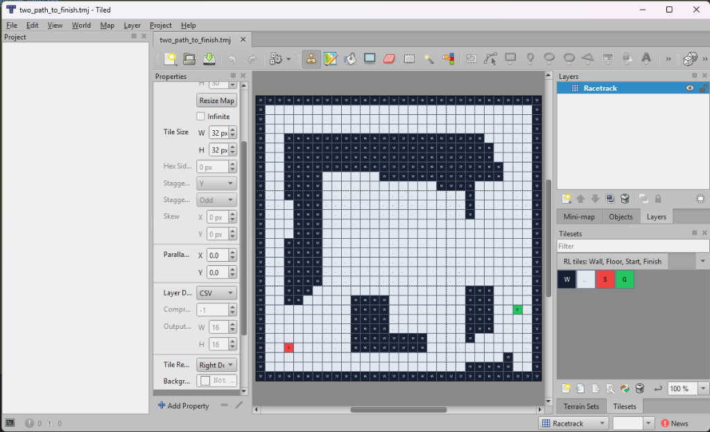

# Drawing Racetrack Maps with Tiled

This guide explains how to design custom racetrack environments visually using the open-source **[Tiled Map Editor](https://www.mapeditor.org/)**.



---

## 🛠️ Setup & Prerequisites

1. Download and install **Tiled** from [mapeditor.org](https://www.mapeditor.org/).
2. Open any starter map in `maps/tiled/`:
   - `maps/tiled/harbor_bend.tmj`: A curved 30×30 racetrack.
   - `maps/tiled/n_shape.tmj`: A multi-bend 30×30 track.
   - `maps/tiled/two_path_to_finish.tmj`: A 30×30 maze map.
3. Keep `rl_tiles.tsj` and `rl_tiles.png` inside `maps/tiled/`.

---

## 🎨 Drawing Your Map in Tiled

1. **Select the Layer**: Make sure you edit the tile layer named **`Racetrack`**.
2. **Tile Palette Legend**:
   | Tile Symbol | Cell Type | Description |
   | :---: | :---: | :--- |
   | **W** (Dark) | `0` | **Wall / Obstacle** (Crashes agent to start) |
   | **.** (Light) | `1` | **Floor / Drivable Track** |
   | **S** (Red) | `2` | **Start Cell / Line** |
   | **G** (Green) | `3` | **Finish Cell / Line** |

3. **Rules**:
   - You must have at least **1 Start cell (`S`)** and at least **1 Finish cell (`G`)**.
   - Erased tiles (empty / GID 0) are treated as Walls.

---

## ⚙️ Map Custom Properties

In Tiled, select **Map -> Map Properties** to customize default environment options:

- `movement_mode` (string): `"bidirectional"` or `"forward-only"`
- `max_velocity` (int): Maximum velocity component (e.g. `2` or `5`)
- `fail_prob` (float): Engine failure/noise probability (e.g. `0.0` or `0.1`)
- `max_episode_steps` (int): Maximum steps allowed per episode (e.g. `50000`)

---

## 🚀 Running Your Custom Map

Save your file as `.tmj` inside `maps/tiled/your_map.tmj`, then train the RL agent:

```powershell
py -3.12 -m ocean_rl --maps maps/tiled/your_map.tmj --episodes 10000 --plot --show
```
